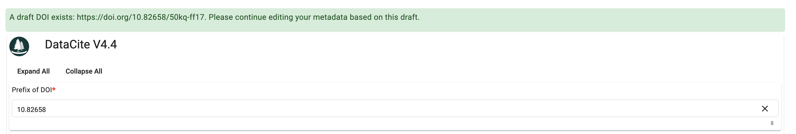

# CEDAR Bridging

CEDAR Bridging, the frontend application designed for requesting Digital Object Identifiers (DOIs) for templates and instances. It empowers users to fill out CEDAR DataCite templates, supplying essential details about templates or instances to generate DOIs. This component is an essential part of the comprehensive CEDAR application. For documentation access, please click [here](https://github.com/metadatacenter/cedar-docs/wiki).

## Features

**User-Friendly Interface:**  
CEDAR Bridging integrates the [Cedar Embeddable Editor](https://github.com/metadatacenter/cedar-embeddable-editor)(CEE) to render the CEDAR DataCite templates. The image below showcases the initial interface when a user is creating a DOI for a template or instance.
   

If a draft has been previously saved, a notification will appear at the top of the page, allowing users to resume editing the pre-saved metadata.


## Getting Started

First, navigate to the cedar-bridging-src directory:
```shell
$ cd <...>/<clone directory>/cedar-bridging/cedar-bridging-src
```

### Install dependencies

`npm install --legacy-peer-deps`

### Development server

Run `ng serve` for a dev server. Navigate to `http://localhost:4340/`. The application will automatically reload if you change any of the source files.

### Code scaffolding

Run `ng generate component component-name` to generate a new component. You can also use `ng generate directive|pipe|service|class|guard|interface|enum|module`.

### Build

Run `ng build` to build the project. The build artifacts will be stored in the `dist/` directory.

### Running unit tests

Run `ng test` to execute the unit tests via [Karma](https://karma-runner.github.io).

### Running end-to-end tests

Run `ng e2e` to execute the end-to-end tests via a platform of your choice. To use this command, you need to first add a package that implements end-to-end testing capabilities.

## Questions

If you have questions about this repository, please subscribe to the
[CEDAR Developer Supportmailing list](https://mailman.stanford.edu/mailman/listinfo/cedar-developers).

After subscribing, send messages to cedar-developers at lists.stanford.edu.


